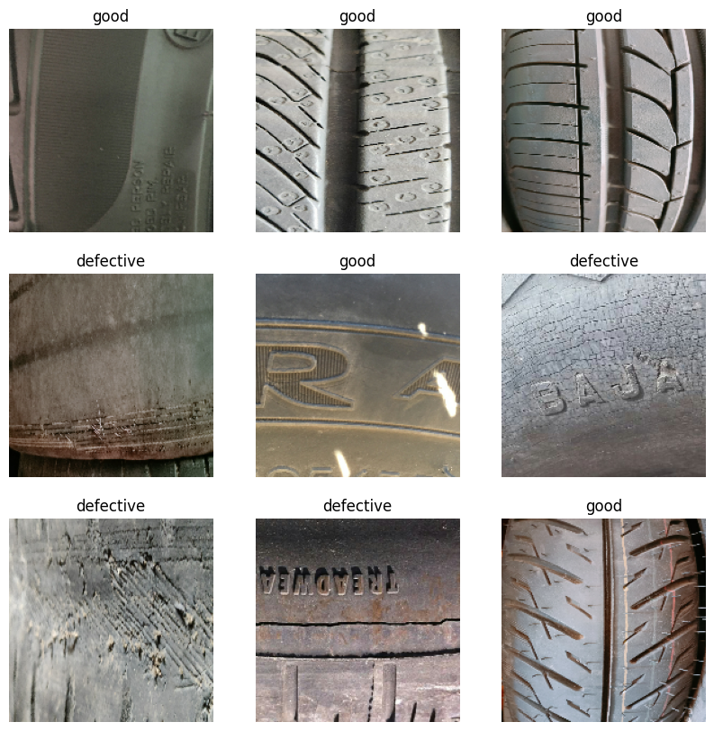
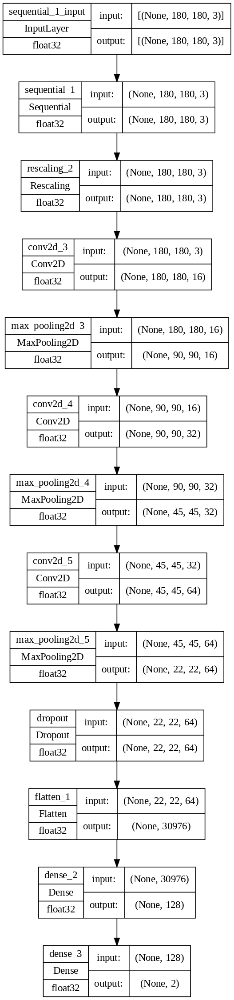
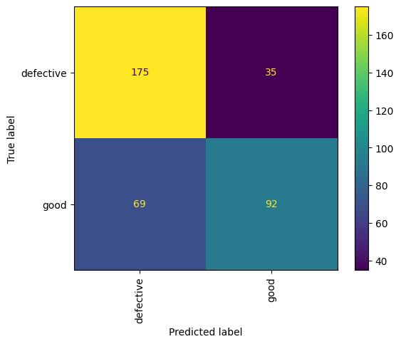
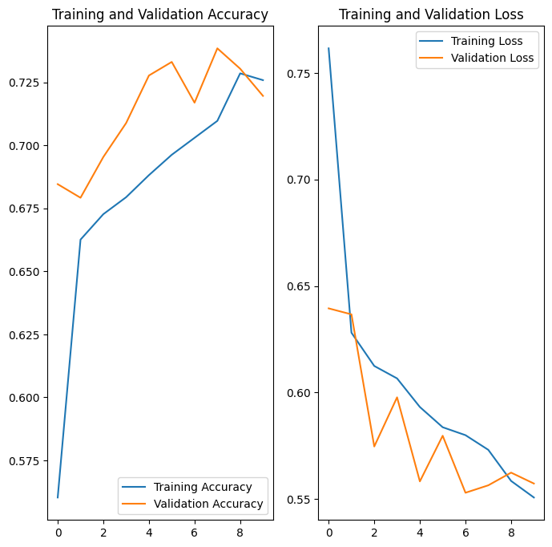

# Tyre Quality Detection with CNN
This project is aimed at building a CNN model to classify tire quality. It uses deep learning techniques to analyze tire images and predict their quality based on the patterns learned from the training data. This classification can help in the automation of quality control in tire manufacturing.

## Dataset

## Model

## Cofusion Matrix

